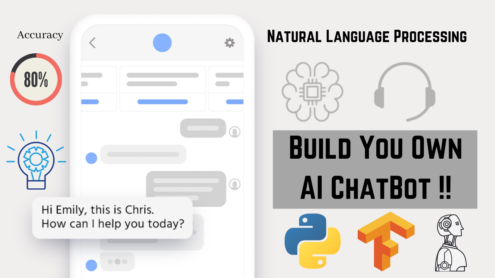

# ChatBot_Tensorflow_NLP
Artificial Intelligent ChatBot using Tensorflow and NLP that understand the Context and Intent of Human Language.

1. What are ChatBots?

2. What ChatBots Can Do?

3. Architecture and Working of ChatBots

4. Core Processes of ChatBots

5. Use Cases of ChatBots

6. Top Healthcare ChatBots

7. Top Companies that Implement ChatBots in Their Business.

8. Top Platforms to Build ChatBots and Tools used in ChatBot Development.

9. Practical Work - Build One Contextual ChatBot Using Python, Tensorflow, and NLP.

